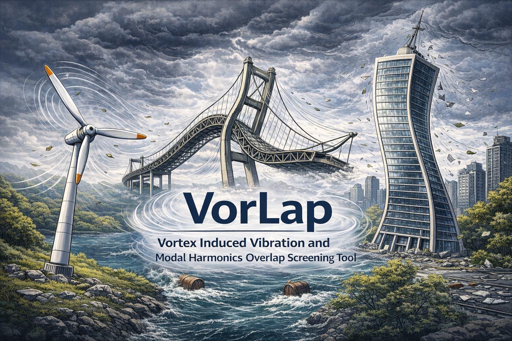

# VorLap

  

VorLap estimates aerodynamic loading and resonance risk for rotating structures by combining:

- Geometry-driven local flow orientation.
- FFT-based airfoil force spectra (`CL`, `CD`, `CF`, `CM`) across Reynolds number and angle of attack.
- Frequency overlap checks between shedding frequencies and structural natural frequencies.

## What VorLap Produces

- Global force maps over inflow speed and azimuth.
- Global moment maps (computed as physical cross products, `r × F`).
- Node-level reconstructed time series for a selected operating point.
- Node-level reconstructed time series for time-varying inflow profiles (`time`, `inflow_speed`, `inflow_direction_deg`).
- QBlade fast-path conversion and export of external loading files (`LOADINGFILE`) for one-way structural forcing.
- Worst-case frequency mismatch metrics and detailed trace strings.

## Verification and Testing

The automated test suite includes:

- Analytical tests for interpolation, rotation, reconstruction, and moment equations.
- File I/O validation tests.
- A single-blade verification case using repository reference data.

See `tests/test_verification_case.py` for the verification-based regression test.
